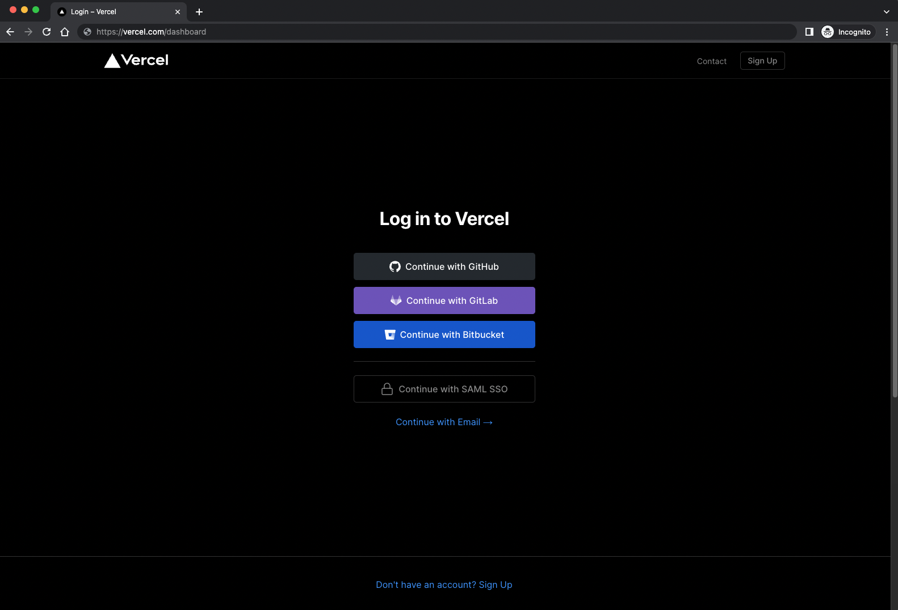
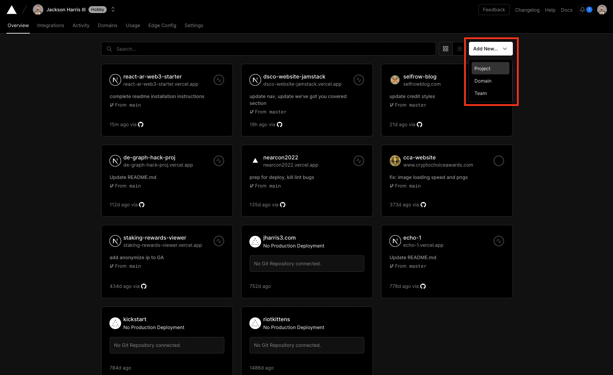
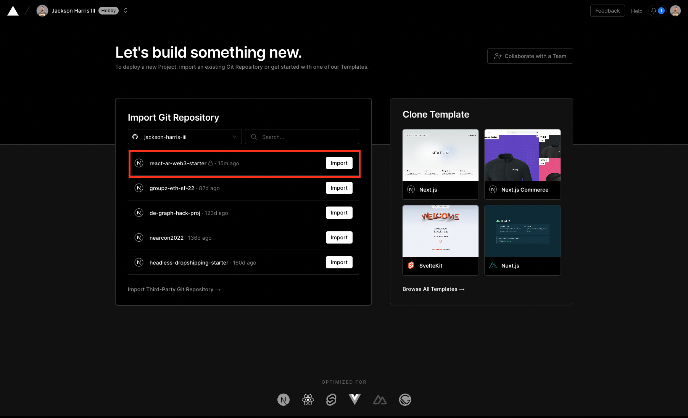
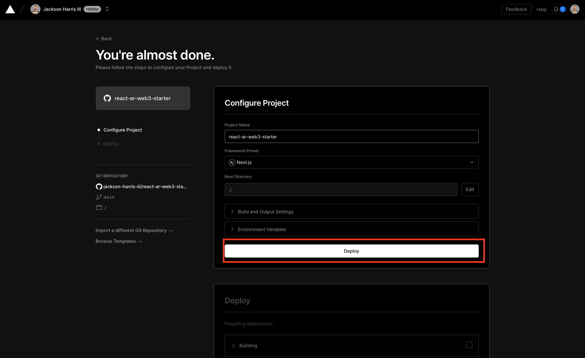
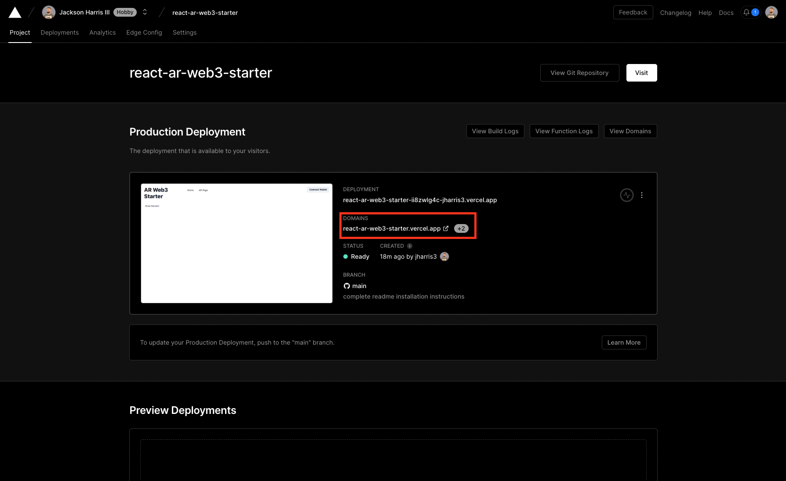
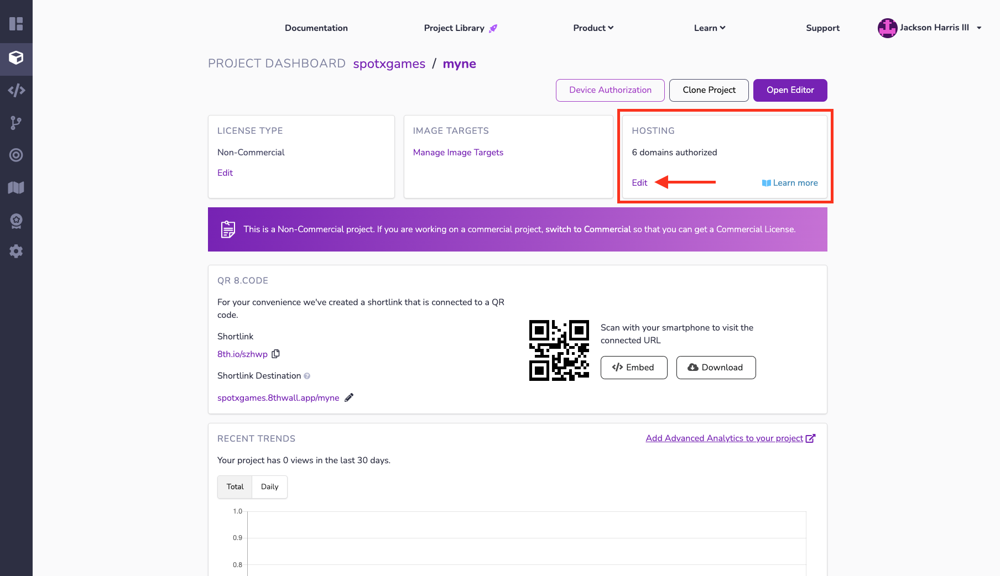
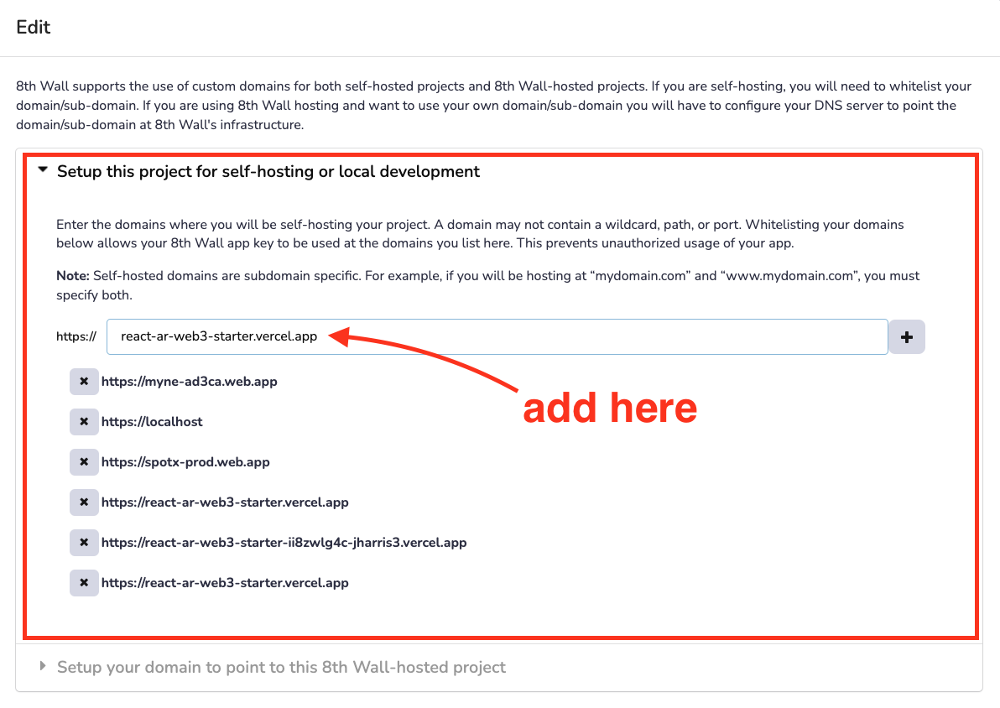
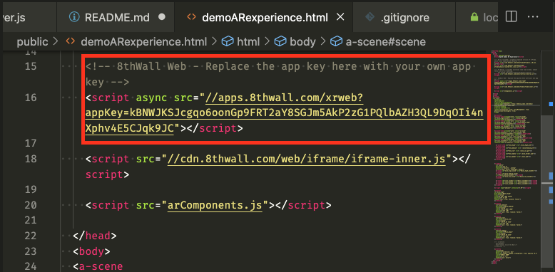
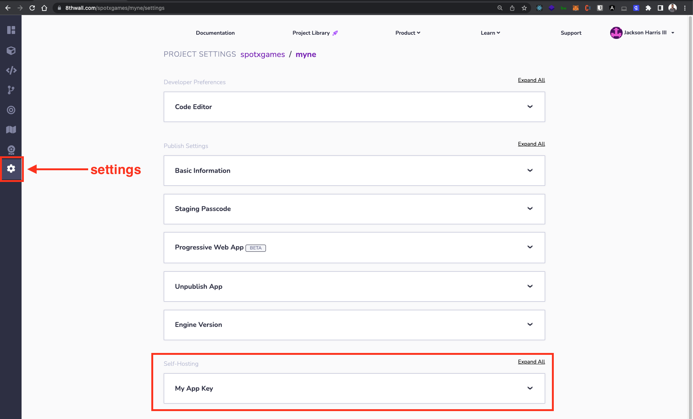

# React AR Web3 Starter

:earth_americas: [Live App Here](https://react-ar-web3-starter.vercel.app/)

## Getting started

To make it easy for you to get started with [8thWall](https://www.8thwall.com/) AR for web and Web3 here's a repo to get you up and running with a [self-hosted](https://www.8thwall.com/docs/web/#self-hosted-domains) version of 8thWall. It includes some pre-configured web3 libraries and it is built using [Next.js](https://nextjs.org/) so you can deploy easily to [Vercel](https://vercel.com/)!

This example assumes you have access to an 8thWall workspace through the[Lightship VPS World Tour](https://lightship.dev/blog/announcing-lightship-vps-world-tour/), an [8thWall free trial](https://www.8thwall.com/start-your-free-trial), or paid account. You will also need a github account which will make deploying to vercel easy and most likely free.

## Installation

- [ ] Clone this repository

  ```
  git clone --- INSERT PUBLIC REPO URL HERE ---
  cd react-ar-web3-starter
  yarn
  ```

- [ ] Install [mkcert](https://github.com/FiloSottile/mkcert) globally

  On macOS, use [Homebrew](https://brew.sh/)

  ```
  brew install mkcert
  brew install nss # if you use Firefox
  ```

  or [MacPorts](https://www.macports.org/).

  ```
  sudo port selfupdate
  sudo port install mkcert
  sudo port install nss # if you use Firefox
  ```

- [ ] Generate a certificate with key by running the following command in the src directory of this repo.

  ```
  mkcert localhost
  ```

- [ ] Start server
  ```
  node server.js
  ```

## Deployment

- [ ] When you're ready to deploy head over to [Vercel](https://vercel.com/dashboard) and sign-in/sign-up with the account where your repository is; github, gitlab, etc.



- [ ] Once you're logged in you're going to click the 'Add New' and select project from the drop down.



- [ ] Import the repo where your code lives



- [ ] Make sure the project name and everything is to your liking then click deploy!



- [ ] Make sure the project name and everything is to your liking then click deploy!



- [ ] Go to your 8thWall workspace and add the domain you just copied to the list of authorized domains



- [ ] Open the "Setup this project for self-hosting or local development" section and paste the domain name you copied WITHOUT "https://" into the input field. Click the "+" button and it needs to appear in the list below



- [ ] **IMPORTANT!** Make sure to double check the app key in your project: `demoARexperience.html` approx at line 16 matches the appkey in your 8thWall workspace!

_The key included in this repo will work for localhost, but WILL NOT work on your deployed app. You will need your own key or check with someone from the VPS World Tour Staff to help get your deployed domain added to the shared workspace._



Make sure that you select the settings page on the left and open the "My App Key" section under Self-Hosting


